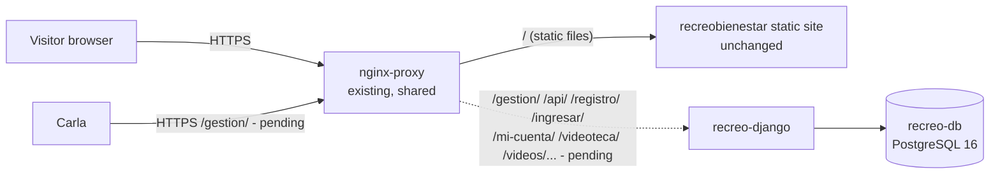
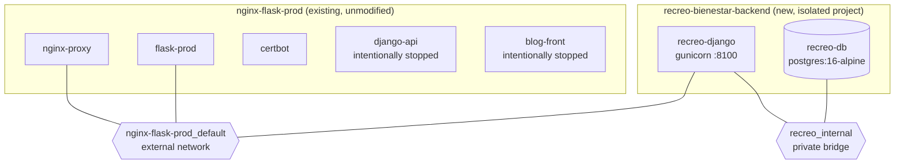
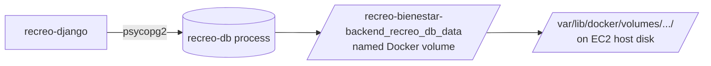
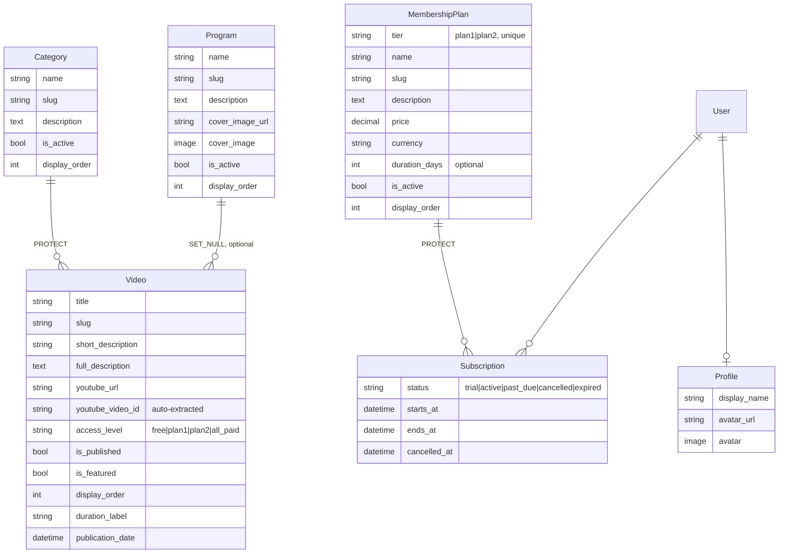
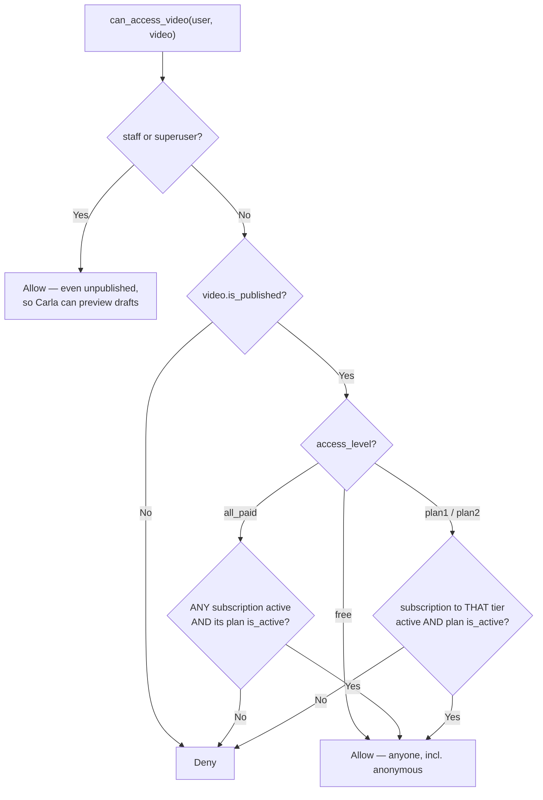
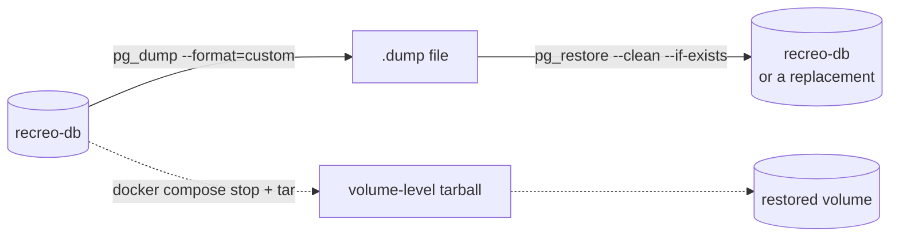

# Recreo Bienestar — Backend Architecture

Status snapshot as of Phase 2b (public auth, member dashboard, real
membership access control, plus a production-readiness audit). Companion
docs: `deploy/PHASE1_DELIVERABLES.md`, `deploy/PHASE2_DELIVERABLES.md`,
`deploy/PHASE2B_DELIVERABLES.md`. This file is the living reference; the
phase docs are point-in-time delivery records.

## 1. System overview

Recreo Bienestar is a Django backend serving three things behind the same
nginx reverse proxy that already serves the static marketing site and
several unrelated client sites on one shared EC2 host: Django Admin
(Carla's content management), a read-only public API, and now a full
public member experience (registration, login, dashboard, video
library/detail with real membership-gated access). Payments are still
explicitly out of scope.



Dotted lines mark routes that are built, tested, and verified against the
live container but **not yet reachable publicly** — see §12.

## 2. Docker architecture

Recreo Bienestar is its own Compose project (`recreo-bienestar-backend`),
deliberately **not** merged into the existing `nginx-flask-prod`
`docker-compose.yml`. It joins that stack's network as an external
dependency so nginx can reach it, without either project needing to know
about the other's internals.



No new container publishes a host port. `recreo-db` is reachable only from
`recreo-django` on `recreo_internal`; `recreo-django` is reachable only
from `nginx-proxy` on the shared network (once routing is applied — see
§12).

## 3. Container and network relationships

| Container | Image | Networks | Published ports | Notes |
|---|---|---|---|---|
| `recreo-django` | built from `backend/Dockerfile` (python:3.11-slim) | `recreo_internal`, `nginx-flask-prod_default` | none | gunicorn, 1 worker/2 threads (memory-sized), WhiteNoise serves static/media |
| `recreo-db` | `postgres:16-alpine` | `recreo_internal` only | none | `pg_isready` healthcheck, named volume |
| `nginx-proxy` | existing | `nginx-flask-prod_default` | 80, 443 | unmodified |
| `django-api`, `blog-front` | existing | `nginx-flask-prod_default` | — | **intentionally stopped**, not part of this project |

## 4. PostgreSQL persistence model



- Dedicated Postgres container — **not** the shared RDS instance used by
  `django-api`. RDS is live infra for an unrelated project, was mid a
  separate cleanup review, and attaching a new schema to it would have
  coupled two unrelated lifecycles. Full isolation was chosen instead.
- Data lives in the named volume `recreo-bienestar-backend_recreo_db_data`,
  which survives `docker compose restart`/`stop`/`up`/container recreation.
  It is only destroyed by an explicit `docker compose down -v`.
- No public port; reachable only from `recreo-django` on `recreo_internal`.
- Backup/restore flow: §14.

## 5. Django project structure

```
backend/
├── config/            settings, URL root, WSGI/ASGI, api_urls.py
├── common/             choices.py, text.py (slug + YouTube parsing),
│                        validators.py, models.py (shared abstract bases),
│                        forms.py (AccessibleFormMixin)
├── accounts/            Profile + auth backend/forms/views (register,
│                        login, logout, password reset, dashboard,
│                        profile edit) + templates + tests
├── catalog/            Category, Program, Video + admin + serializers +
│                        API views (views.py) + public HTML views
│                        (public_views.py) + filters + templates + tests +
│                        management/commands/seed_demo_data.py
├── memberships/         MembershipPlan, Subscription + access-control
│                        service + admin + serializers + views + tests
├── templates/            base.html, 404.html, 500.html, shared partials
├── static/site/          CSS/JS copied from the static site (unmodified)
│                        + one additive stylesheet
├── deploy/              nginx configs (proposed/snippet), phase docs
├── Dockerfile, entrypoint.sh, docker-compose.yml, requirements.txt
└── manage.py, .env.example
```

`common` exists specifically so `accounts`, `catalog`, and `memberships`
never need to import each other's models to agree on what a
"plan1/plan2/free/all_paid" access level means — all three read the same
`VideoAccessLevel`/`PlanTier` enums, and all three's forms share one
accessibility mixin.

## 6. Domain models



All models plus `MembershipPlan`/`Category`/`Program` inherit
`created_at`/`updated_at` from a shared `TimeStampedModel` mixin; the three
catalog-ish ones also share `is_active`/`display_order` via
`OrderedActiveModel` (now indexed — see §17). `Profile.email` is a
*property* reading `user.email`, not a stored column, so the two can never
drift apart; it's auto-created via a `post_save` signal on `User`.

## 7. Access-control logic

**Now wired into every place that shows video content** — Django Admin
(implicitly, staff bypass), the public video library/detail pages, the
member dashboard, and the read-only API. `memberships/services.py`
remains the single decision point; nothing else re-derives these rules:



`Subscription.is_active()` checks `status in {trial, active, cancelled}`
**and** `not is_expired()` — a stale `active` status never overrides a
passed `ends_at`, and a *cancelled* subscription keeps access until
`ends_at` (cancelling stops renewal, not the period already paid for).
`plan.is_active` is checked separately: a deactivated plan grants no
access even to an otherwise-valid subscription.

**Performance**: every function in this module accepts an optional
`subscriptions` list — pass a pre-fetched
`list(user.subscriptions.select_related('plan'))` when checking many
videos in one request (dashboard, library, API list) or each video would
re-query the user's subscriptions individually (see §17).

**Where each surface enforces it:**
- `catalog/public_views.py:video_detail` — checked before any
  YouTube field enters the template context; locked → `video_locked.html`
  (403), which receives no YouTube fields at all.
- `catalog/views.py:VideoViewSet.retrieve` — same check, before the
  serializer runs; locked → HTTP 403, no body fields.
- `catalog/serializers.py:VideoListSerializer.get_thumbnail` — the
  thumbnail is itself sensitive (it embeds the video ID when no explicit
  `thumbnail_url` is set), so it's null for videos the caller can't
  access, even in list views.
- `catalog/templates/catalog/partials/_video_card.html` — locked cards
  render a generic placeholder, never `thumbnail_display_url`.
- `accounts/views.py:dashboard` — stamps `video.unlocked` on every video
  once, server-side; templates read that, never re-derive it.

## 8. Django Admin responsibilities

Carla's entire workflow today. Reachable at `/gestion/` once nginx routing
lands (§12); currently only reachable directly on the server (not
publicly). Per model:

- **Category / Program**: create/edit, active toggle, drag-free manual
  `display_order` (list-editable), bulk activate/deactivate.
- **Video**: full CRUD, category/program autocomplete, access-level picker,
  YouTube URL validated + video ID auto-extracted on save, thumbnail
  preview, bulk publish/unpublish/mark-free, list-editable display order.
- **MembershipPlan**: name/description/price/currency/duration editing,
  price validated non-negative, bulk activate/deactivate, live subscriber
  count.
- **Subscription**: status with a colored "current access" badge (computed
  from `is_active()`, not just the raw status field), bulk cancel.
- **Profile**: read/search only from the admin (`has_add_permission` is
  disabled — profiles are only ever created via the `post_save` signal).

No public-facing admin functionality exists — everything here requires
Django staff auth (see §10).

## 9. REST API endpoints

All under `/api/` (routing to nginx pending — see §12; reachable directly
on the server today). Every endpoint is **read-only**: list/retrieve
handlers only exist, so POST/PUT/PATCH/DELETE return 405 everywhere — there
is no write path to secure because none was built.

| Endpoint | Returns | Filters |
|---|---|---|
| `GET /api/categories/` | active categories | — |
| `GET /api/programs/` | active programs | — |
| `GET /api/videos/` | published videos, per-viewer thumbnail (null if locked to them) | `?category=<slug>` `?program=<slug>` `?access_level=<level>` |
| `GET /api/videos/<slug>/` | one video if accessible to the caller, **403 (not 404) if locked** | — |
| `GET /api/plans/` | active plans | — |

Paginated (`PageNumberPagination`, 20/page). Serializers hand-pick fields —
`is_active`/`is_published`/timestamps/raw FK ids/raw `youtube_url` are
never exposed, and (since the Phase 2b audit — §17) neither is
`youtube_video_id` or the derived thumbnail for a video the caller can't
access, checked via the same `can_access_video` used everywhere else.
Same-origin only; no CORS package installed (nothing to configure yet —
add an explicit allow-list, never a wildcard, if a separate frontend
origin appears later).

## 10. Current authentication status

- **Django Admin**: standard Django session auth (`django.contrib.auth`),
  staff/superuser only, entirely separate flow from public member login.
  Carla's superuser (`admincarla`) **exists**, created outside this
  codebase as instructed (credentials never handled by Claude).
- **Public members**: full registration/login/logout/password-reset flow
  now exists (`accounts` app). Login accepts username OR email via a
  custom `EmailOrUsernameModelBackend`. Sessions are the only mechanism —
  no tokens, no social login. See §17 for the security properties audited.
- **REST API**: `AllowAny` + `SessionAuthentication` (added in the Phase
  2b audit — see §17 for why `AllowAny` alone was no longer sufficient
  once the API needed to know *who* was asking).

## 11. Current production deployment status

| Component | Status |
|---|---|
| `recreo-django` | running, healthy, all Phase 2b + audit fixes deployed |
| `recreo-db` | running, healthy, all migrations applied, never recreated across any redeploy in this project's history |
| Django Admin (`/gestion/`) | working — verified directly against the container; **not publicly routed** |
| REST API (`/api/...`) | working, membership-gated — verified directly against the container; **not publicly routed** |
| Public auth + dashboard + video library/detail | working — verified end-to-end directly against the container (register/login/dashboard/library/detail/logout); **not publicly routed** |
| Static site (`/`) | untouched, verified live over HTTPS |
| `django-api` / `blog-front` | intentionally stopped (memory headroom), untouched |
| nginx routing | prepared for the full route set, **not applied** (§12) |

## 12. Nginx routing — still pending

`backend/deploy/recreobienestar.conf.proposed` adds `location` blocks for
`/gestion/`, `/api/`, the public auth/dashboard/library paths (via one
regex location), and `/static/`/`/media/` (with `^~` — needed so they
aren't shadowed by the static site's own `\.(css|js|...)$` regex block,
a real routing bug caught and fixed while drafting this) to the existing
`recreobienestar.com` server block, before its catch-all `location /`. It
does not touch the static site's routing, `ssl_certificate` lines, or any
other domain's config.

**Blocked by a pre-existing, unrelated issue**, not by this config:
`nginx -t` fails on `nginx-flask-prod/nginx/conf.d/default.conf` (a
different file, for `estebanmartins.com.ar`), because it references the
`blog-front` upstream by container name and `blog-front` is intentionally
stopped — Docker's embedded DNS won't resolve a stopped container, and
nginx refuses to reload the *entire* config file set until every
referenced upstream resolves. This was confirmed by restoring the
untouched original `recreobienestar.conf` and reproducing the identical
`nginx -t` failure.

Unblocks when either: `blog-front` comes back up, or `default.conf` is
changed to resolve upstreams dynamically (a `resolver` directive + variable
in `proxy_pass`) — the second option touches a file outside this project's
scope and needs explicit sign-off first.

## 13. Environment variables

Defined in `backend/.env.example`; the real `.env` exists only on the
server (`/home/ubuntu/recreo-bienestar-backend/.env`, `chmod 600`), never
committed.

| Variable | Purpose |
|---|---|
| `SECRET_KEY` | Django cryptographic signing |
| `DEBUG` | must be `False` in production (confirmed) |
| `ALLOWED_HOSTS` | comma-separated, locked to the real domain |
| `CSRF_TRUSTED_ORIGINS` | comma-separated, `https://` origins |
| `ADMIN_URL` | mount point for Django Admin, default `gestion/` |
| `DB_NAME`, `DB_USER`, `DB_PASSWORD`, `DB_HOST`, `DB_PORT` | Postgres connection |
| `DJANGO_SECURE_SSL_REDIRECT` | `True` in production; nginx terminates TLS and forwards `X-Forwarded-Proto` |

No new variables in Phase 2b. `STATIC_URL`/`MEDIA_URL` moved from
`/gestion/static//media/` to top-level `/static/`/`/media/` (harmless —
nginx was never reloaded with the old paths live). `EMAIL_BACKEND` is
hardcoded to the console backend (not env-configurable) since real email
is explicitly out of scope this phase — see
`deploy/PHASE2B_DELIVERABLES.md` §12 for what production email will need.

## 14. Backup and restore flow



Logical backup (preferred for routine use):
```bash
docker exec recreo-db pg_dump -U recreo_admin -d recreo_bienestar \
  --format=custom > recreo_bienestar_$(date +%Y%m%d_%H%M%S).dump
```
Restore:
```bash
docker cp recreo_bienestar_YYYYMMDD_HHMMSS.dump recreo-db:/tmp/restore.dump
docker exec recreo-db pg_restore -U recreo_admin -d recreo_bienestar \
  --clean --if-exists /tmp/restore.dump
```
Volume-level (whole data directory, container briefly stopped):
```bash
docker compose stop recreo-db
docker run --rm -v recreo-bienestar-backend_recreo_db_data:/data \
  -v $(pwd):/backup alpine tar czf /backup/recreo_db_volume_$(date +%Y%m%d).tar.gz -C /data .
docker compose start recreo-db
```
Both tested end-to-end during Phase 2 (dump created, contents listed via
`pg_restore --list`, then deleted — no artifacts left behind).

## 15. Known infrastructure constraints

- **t2.micro, 954MB RAM, 0 swap.** Baseline OS/daemon overhead
  (`dockerd`+`containerd`+`fail2ban`+`snapd`+`amazon-ssm-agent`) alone is
  ~240MB. `django-api`/`blog-front` had to be stopped to make room for
  `recreo-django`/`recreo-db` during development — this is why nginx
  routing can't be finished without either bringing them back or fixing
  the `default.conf` coupling (§12).
- **Recommendation**: t3.small (2GB RAM) before running the full original
  container set alongside Recreo Bienestar long-term; a small swap file
  (1–2GB) is also a cheap safety net regardless of instance size. Neither
  has been applied — both are host-level changes outside this phase.
- **Disk**: ~3.8GB free of 11GB at last check — enough for now, worth
  watching as more container images/log volume accumulate.
- **Single point of failure**: one EC2 instance serves this and several
  unrelated client sites; no HA, no staging environment.

## 16. Future phases (not started)

- **Memberships going fully live** — Phase 2b wired real access control
  into every surface, but nothing yet lets a member *acquire* a paid
  subscription — that's §"Payments" below. `Subscription`/`MembershipPlan`
  are fully modeled, tested, and enforced; they just have no public
  purchase path.
- **Payments** — plan purchase/renewal, likely a provider webhook driving
  `Subscription.status`/`ends_at`. Explicitly out of scope through Phase 2b.
  Mercado Pago named explicitly as still not implemented.
- **Webhooks** — inbound (payment provider → subscription state) and
  possibly outbound (e.g. notifying on new video publish). Not designed
  yet.
- **Production email** — see `deploy/PHASE2B_DELIVERABLES.md` §12 for the
  SES/SMTP env vars this will need.

## 17. Security audit (Phase 2b)

Performed before committing, per explicit request, covering security,
membership rules, UX, database, performance, and accessibility. Found and
fixed four real issues rather than confirming everything was already
fine — full detail in `deploy/PHASE2B_DELIVERABLES.md` §"Audit findings";
summarized here since they changed the architecture:

1. **API authorization bypass** (most significant finding): the DRF API
   was built in Phase 2, before per-video membership access control
   existed as a public concept. `VideoDetailSerializer` exposed
   `youtube_video_id` for *any* published video regardless of
   `access_level`, and `VideoListSerializer`'s thumbnail did the same
   implicitly (the thumbnail fallback derives a URL from the video ID).
   `_video_card.html` had the identical bug for locked cards in the HTML
   library/dashboard. Fixed by wiring `can_access_video` into the API
   (`VideoViewSet.retrieve` returns 403 pre-serialization;
   `SessionAuthentication` added so the API can tell who's actually
   asking) and into the card partial. See §7 and §9.
2. **`User.email` had no database-level unique constraint** — only an
   application-level check, a real TOCTOU race. Fixed with a raw-SQL
   migration adding a case-insensitive partial unique index directly on
   `auth_user`, without swapping `AUTH_USER_MODEL`.
3. **N+1 queries**: `can_access_video` re-queried the user's subscriptions
   on every call; checking N videos (dashboard, library, API list) meant
   N extra queries. Fixed by threading an optional pre-fetched
   `subscriptions` list through the service layer — same function, same
   rules, batched. Verified with query-count regression tests (not just
   asserted) on all three surfaces.
4. **Login dropped `?next=`**: an overridden `get_success_url()` always
   redirected to the dashboard, silently breaking "take me back to what I
   was doing" after being bounced to login from a protected page. Removed
   the override — Django's own default already does this correctly.

Also added: missing indexes on `is_active`/`is_published` (the columns
nearly every query filters on), branded `404.html`/`500.html` (Django's
bare-bones English defaults were live in production under `DEBUG=False`),
and `aria-describedby`/`aria-invalid` wiring on this app's own forms via a
shared `AccessibleFormMixin` + `_form_field.html` partial (a mismatched-id
bug in the first attempt was itself caught by the test written for it).

## 18. Rollback procedures

- **Server containers**: `cd /home/ubuntu/recreo-bienestar-backend &&
  docker compose down -v` — removes `recreo-django`, `recreo-db`, their
  networks and volumes (⚠️ `-v` deletes the database — take a backup first,
  §14). Does not touch `nginx-flask-prod` in any way.
- **Migration rollback**: `docker exec recreo-django python manage.py
  migrate accounts 0001` reverts the email unique index (and, further,
  `migrate accounts zero` removes Profile entirely — no other app depends
  on it). `migrate catalog 0001` / `migrate memberships 0001` drop the new
  indexes only, no data loss either way.
- **nginx**: nothing has been applied yet (§12), so there's nothing to roll
  back. If it's later applied and needs reverting: restore
  `nginx/conf.d/recreobienestar.conf` from `nginx-flask-prod` git history
  (or from the timestamped `.bak-*` file left alongside it) and re-run
  `nginx -t` before reloading.
- **This repo**: `git checkout main` — `feature/django-backend` and the
  checkpoint tag `checkpoint-before-django-backend-20260805` stay available
  for diffing or resuming; nothing has been merged into `main`.
- **Server source**: `rm -rf /home/ubuntu/recreo-bienestar-backend` removes
  the synced source, built image, and `.env` from the host entirely.

## 19. Commands required to resume development

```bash
# Sync latest backend/ to the server (from this repo, local machine)
rsync -az --exclude='.git' --exclude='__pycache__' --exclude='.env' \
  backend/ ubuntu@<ec2-host>:/home/ubuntu/recreo-bienestar-backend/

# Rebuild + redeploy Django only (recreo-db untouched)
cd /home/ubuntu/recreo-bienestar-backend
docker compose up -d --build recreo-django

# Run the test suite (ephemeral, sqlite, no persistent state)
docker run --rm \
  -e SECRET_KEY=test -e DEBUG=False -e ALLOWED_HOSTS=localhost \
  -e CSRF_TRUSTED_ORIGINS=https://localhost \
  -e DB_NAME=x -e DB_USER=x -e DB_PASSWORD=x -e DB_HOST=x -e DB_PORT=5432 \
  -e DJANGO_SETTINGS_MODULE=config.settings_test_sqlite \
  --entrypoint python recreo-bienestar-backend-recreo-django manage.py test

# Create Carla's superuser (interactive — needs her real email/username)
docker exec -it recreo-django python manage.py createsuperuser

# Check container/DB health
docker ps --format 'table {{.Names}}\t{{.Status}}'
docker exec recreo-db pg_isready -U recreo_admin -d recreo_bienestar
```
