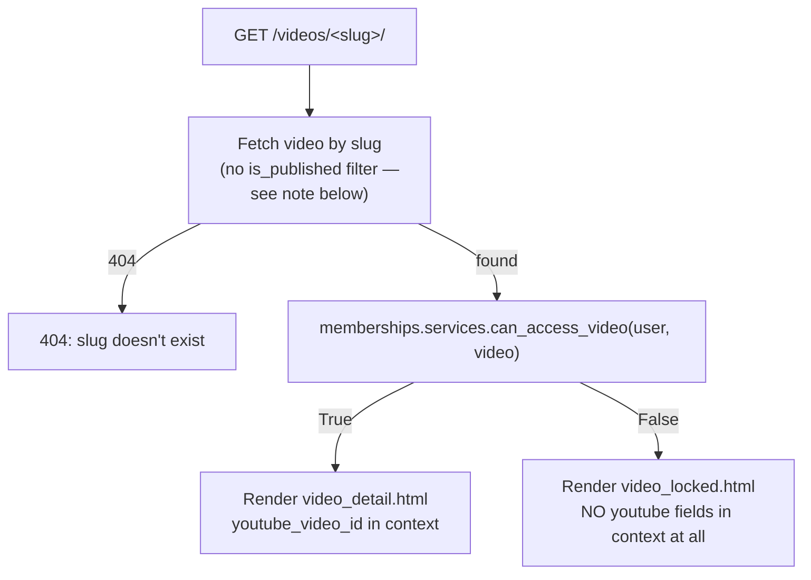

# Recreo Bienestar — Phase 2b Deliverables

Public authentication, member dashboard, and real membership-based access
control. Branch `feature/django-backend` (same branch as Phase 1/2 — no new
branch needed; changes are additive, not a rewrite). **Nothing committed or
pushed** — this doc, the diff, and the test results below are for your
review before that happens. No payments, no Mercado Pago, no Terraform/DNS/
certificate/firewall changes, no restart of the intentionally-stopped
`nginx-flask-prod` containers.

## 1. Authentication architecture

- **User model**: Django's built-in `auth.User`, unchanged — not swapped
  for a custom model (doing so now would require unwinding already-applied
  migrations and the `Subscription.user` FK from Phase 1). Email-based
  identity is layered on top via a custom auth backend.
- **`accounts.backends.EmailOrUsernameModelBackend`**: looks up by
  `username__iexact` OR `email__iexact`, falls back to `ModelBackend` in
  `AUTHENTICATION_BACKENDS` so anything relying on default behavior (e.g.
  Django Admin's own login, which stays completely separate — see §10) is
  unaffected. Runs the password hasher even on a nonexistent user to avoid
  timing-based account enumeration.
- **Registration**: email + password (username is auto-derived from the
  email's local part, disambiguated on collision — members never see or
  pick one). Uses Django's `AUTH_PASSWORD_VALIDATORS` (already configured
  in Phase 1: similarity, minimum length, common-password, all-numeric
  checks) unchanged.
- **Session security**: `SESSION_COOKIE_SECURE`, `CSRF_COOKIE_SECURE`,
  `SESSION_COOKIE_HTTPONLY` were already `True`-in-production from Phase 1;
  nothing new needed here.
- **Logout**: explicitly restricted to POST (`http_method_names = ['post',
  'options']`) — rendered in the nav as a small `<form>` with a CSRF token,
  never a plain link, so it can't be triggered by a bare cross-site GET.
- **Password reset**: Django's standard token-based flow (`PasswordResetView`
  → email with a signed link → `PasswordResetConfirmView` → done), console
  email backend (see §14).

## 2. Routes created

| Path | View | Auth required | Notes |
|---|---|---|---|
| `/registro/` | `accounts.RegisterView` | — | logs in immediately on success |
| `/ingresar/` | `accounts.MemberLoginView` | — | username OR email |
| `/salir/` | `accounts.MemberLogoutView` | logged in | **POST only** |
| `/recuperar-clave/` | `accounts.MemberPasswordResetView` | — | |
| `/recuperar-clave/enviado/` | `MemberPasswordResetDoneView` | — | |
| `/recuperar-clave/confirmar/<uidb64>/<token>/` | `MemberPasswordResetConfirmView` | — | |
| `/recuperar-clave/completado/` | `MemberPasswordResetCompleteView` | — | |
| `/mi-cuenta/` | `accounts.dashboard` | **yes** | redirects to `/ingresar/?next=...` |
| `/mi-cuenta/perfil/` | `accounts.ProfileEditView` | **yes** | not in the original route list, added because "user profile" (goal 5) needs an actual edit surface, not just display |
| `/videoteca/` | `catalog.public_views.video_library` | — | `?category=`, `?program=`, `?page=` |
| `/videos/<slug>/` | `catalog.public_views.video_detail` | — | access-checked server-side per request |
| `/gestion/` | Django Admin | staff | **unchanged** |
| `/api/...` | DRF | — | **unchanged** |

`/` (the landing page) is still not a Django route — it's the existing
static site, served directly by nginx.

## 3. Models added or modified

- **New**: `accounts.Profile` (user OneToOne, `display_name`, `avatar_url`,
  `avatar` image, timestamps). `email` is a *property* reading
  `user.email`, not a stored column — avoids the two ever drifting apart.
  Auto-created via a `post_save` signal on `User`, so every user (including
  the pre-existing superuser) gets one on first touch via `get_or_create`
  in the views.
- **Modified**: `Video` gained `thumbnail_display_url` (a property — moved
  the thumbnail-fallback logic here from being duplicated in the DRF
  serializer and the admin; both now call this one property).
- **Domain rule fix**: `common.choices.ENTITLED_STATUSES` now includes
  `CANCELLED` (previously only `trial`/`active`). See §7 — this was a real
  behavior gap, not a stylistic change, caught while writing this phase's
  tests.
- **Domain rule fix**: `memberships.services.user_has_active_plan` /
  `user_has_any_active_paid_plan` now also require `plan.is_active` —
  "inactive plans do not grant access" was stated in both phases' specs
  but nothing enforced it until a video was actually reachable publicly.

## 4. Templates created

Reuses `css/style.css` **copied verbatim** (not modified) from the static
site into `backend/static/site/`, plus one new additive stylesheet
(`app.css`: alerts, form errors, pagination, empty states, dashboard grid)
built on the same CSS variables — no visual system was reinvented.

```
backend/templates/base.html                    — shared shell, nav adapts to auth state
backend/templates/partials/_icons.html          — SVG sprite (subset reused from the site)
backend/templates/partials/_messages.html       — Django messages → .alert
accounts/templates/accounts/
  register.html, login.html, profile_edit.html, dashboard.html
  password_reset_{form,done,confirm,complete}.html, password_reset_email.html
catalog/templates/catalog/
  video_library.html, video_detail.html, video_locked.html
  partials/_video_card.html                     — shared by dashboard + library
```

## 5. Access-control flow



`can_access_video` (the single decision point — views and templates never
re-derive it):
1. Staff/superuser → **always True** (including unpublished — lets Carla
   preview drafts without a subscription).
2. Not published → **False**.
3. `free` → **True** (incl. anonymous).
4. `all_paid` → True if any subscription is active **and** its plan is
   active.
5. `plan1`/`plan2` → True if a subscription to that exact tier is active
   **and** that plan is active.

`Subscription.is_active()` = `status in {trial, active, cancelled}` **and**
`not is_expired()`. Cancelled-but-not-yet-ended subscriptions keep access
(§3); expired ones lose it the instant `ends_at` passes, regardless of what
`status` says.

The video detail view deliberately does **not** filter unpublished videos
out of the initial query — filtering there would 404 staff before they
ever reach the bypass in step 1. The decision is made exactly once, in one
function.

## 6. Test results

```
Ran 87 tests in 19.567s
OK
```
34 (Phase 1) + 19 (Phase 2 API) + 34 new this phase. Covers every scenario
requested: registration (success, duplicate email, weak password),
login by username/by email/wrong-password error message, logout
(POST-only, clears session), password reset (email sent, unknown address
doesn't leak), free/active/expired/cancelled/inactive-plan/unpublished
access scenarios (both at the service layer and through real HTTP
requests), staff bypass (including unpublished), locked page verified to
contain neither the video ID nor the word "youtube" anywhere in its HTML,
dashboard membership status display, protected-route redirects, and the
existing DRF write-method rejection tests (unchanged, still passing).

Run against the exact image built for deployment
(`recreo-bienestar-backend-recreo-django`), via a disposable sqlite-backed
container — touches nothing persistent.

**Bug caught by this test suite, fixed before it passed** (documented for
transparency): the multi-line `{# ... #}` comments I first wrote in
`video_locked.html` and `_video_card.html` aren't valid Django
syntax (that form is single-line only) — they rendered as literal text
instead of being stripped, and `test_locked_page_does_not_leak_youtube_id`
caught it immediately. Fixed with `...`.

## 7. Deployment status

- `recreo-django`: rebuilt, redeployed, healthy. `accounts.0001_initial`
  applied. `recreo-db` was **never recreated** during this (`Running`
  throughout, confirmed via `docker compose up -d --build recreo-django`
  output).
- Full flow smoke-tested internally against the live container: register
  → (skipped, used seeded users instead) → login (username and email both
  work) → dashboard shows correct plan/status → video library loads →
  active member sees the paid video (200, real embed ID present) →
  anonymous denied the same video (403, ID absent) → logout → dashboard
  redirects to login. All as expected.
- `docker exec recreo-django python manage.py seed_demo_data` run — see
  §8.
- Static landing page: `https://recreobienestar.com/` still 200.
- `django-api`/`blog-front`: still absent from `docker ps -a`, untouched.
- Memory: ~63MB free / 954MB total, 0 swap — same steady-state range as
  before this phase (no new containers were added).

## 8. Seed / demo data

```bash
docker exec recreo-django python manage.py seed_demo_data
```
Idempotent (`get_or_create` throughout). Creates:
- `demo_free` — no subscription (free tier)
- `demo_activo` — active Plan Esencial subscription, ends in 30 days
- `demo_vencido` — Plan Esencial subscription that already ended (expired)
- 2 membership plans (Plan Esencial / Plan Premium), 1 category, 1 program
- 1 free published video, 1 plan1-gated published video, 1 unpublished
  draft (to click through the staff-preview bypass)

⚠️ **Dev-only credentials, intentionally public**: all three demo users
share the password `RecreoDemo#2026`, printed by the command and documented
here on purpose — anyone who needs to reset it knows where to find it. Not
used anywhere in production data; do not reuse this password for anything
real.

## 9. Deployment blockers

**nginx routing is still not applied** — same root cause as Phase 2,
re-verified today: `nginx -t` fails on `nginx-flask-prod/nginx/default.conf`
(line 154, `estebanmartins.com.ar`'s config — completely unrelated to
Recreo Bienestar), because it references the intentionally-stopped
`blog-front` container by name and Docker's embedded DNS won't resolve a
stopped container. This blocks reloading nginx *at all*, not just adding
Recreo Bienestar's routes.

I looked at two alternate paths before concluding there isn't a safe one
this phase either:
- **A separate reverse-proxy path** (new nginx server/container, or
  exposing `recreo-django` on its own port) — would need a new DNS
  record or a new public port on the security group, both explicitly
  off-limits (no Terraform/Route53/certificate/firewall changes).
- **Patching `default.conf`'s upstream resolution** (the standard nginx
  fix: a `resolver` directive + variable in `proxy_pass` so a stopped
  upstream doesn't block reload) — technically safe and wouldn't change
  `estebanmartins.com.ar`'s behavior at all, but it does mean touching a
  file outside Recreo Bienestar's scope, which needs your explicit sign-off
  first, not mine to assume.

`backend/deploy/recreobienestar.conf.proposed` and
`nginx-gestion.snippet.conf` are updated with the full Phase 2b route set
(auth/dashboard/library paths, plus `/static/` and `/media/` with the `^~`
modifier needed so they aren't shadowed by the static site's existing
`\.(css|js|...)$` regex block — a real routing bug I caught while writing
the draft, fixed before it went anywhere). Ready to apply the moment either
option above is authorized.

## 10. Manual steps remaining

1. Resolve the nginx blocker (§9) — your call on which option.
2. Once nginx is live, do a fresh external HTTPS click-through
   (register → login → dashboard → videoteca → video detail) — everything
   below has only been verified by talking to the container directly, not
   through nginx yet.
3. Configure real transactional email before relying on password reset in
   production (see §14).
4. Decide when to bring `django-api`/`blog-front` back up.
5. Review this diff and, when ready, `git add`/commit/push
   `feature/django-backend` — not done, per your instruction.
6. Consider running `seed_demo_data` on a throwaway/staging DB only, never
   against real member data, given its fixed dev password.

## 11. Environment variables

No new variables this phase — same `.env` keys as Phase 2
(`SECRET_KEY`, `DEBUG`, `ALLOWED_HOSTS`, `CSRF_TRUSTED_ORIGINS`,
`ADMIN_URL`, `DB_*`, `DJANGO_SECURE_SSL_REDIRECT`). `STATIC_URL`/`MEDIA_URL`
moved from `/gestion/static//media/` to top-level `/static/`/`/media/` in
settings (nginx was never reloaded with the old paths live, so nothing
public depended on them — see `backend/deploy/PHASE2_DELIVERABLES.md`).

## 12. Email (production requirements, not configured now)

Per your instruction, this phase uses `EMAIL_BACKEND =
django.core.mail.backends.console.EmailBackend` — password reset emails
are printed to `docker logs recreo-django`, not actually sent. Confirmed
working in tests (`django.core.mail.outbox`) and manually. Production will
need, added as env vars the same way `DB_*` are handled, never hardcoded:
`EMAIL_BACKEND` (SMTP), `EMAIL_HOST`, `EMAIL_PORT`, `EMAIL_HOST_USER`,
`EMAIL_HOST_PASSWORD`, `EMAIL_USE_TLS`, `DEFAULT_FROM_EMAIL` — most likely
via SES given the AWS-hosted stack (an SES domain identity would need to
exist for `recreobienestar.com`, which the `terraform-prod` repo doesn't
currently define — that's a Terraform change, out of scope for this repo
and this phase).

## 13. Rollback procedure

- **Server container**: `cd /home/ubuntu/recreo-bienestar-backend && docker
  compose up -d --build recreo-django` re-deploys; to fully revert, `git
  checkout` this repo to the Phase 2 commit locally, re-sync, and rebuild.
  `recreo-db`'s data is untouched by any of this (only `accounts_profile`
  table was added — reverting the code doesn't drop it, but it'll simply
  go unused).
- **Migration rollback** (only if truly needed —
  `accounts.0001_initial` has no data dependencies from other apps):
  `docker exec recreo-django python manage.py migrate accounts zero`.
- **nginx**: nothing was applied, so nothing to roll back.
- **Local repo**: nothing has been committed this phase — `git status`
  shows everything as uncommitted changes on `feature/django-backend`;
  discard with `git checkout -- backend/` plus `git clean -fd backend/` if
  you decide not to proceed, no history to unwind.
